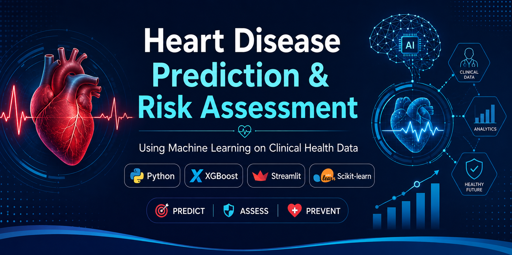

<p align="center">
  
</p>

# ❤️ Heart Disease Prediction & Risk Assessment Using Machine Learning On Clinical Health Data


## 📌 Project Overview

This project predicts the likelihood of heart disease using Machine Learning techniques on clinical health data. It also provides a personalized heart disease risk assessment by calculating a risk score and categorizing patients into Low, Moderate, or High Risk.

The application is deployed using **Streamlit**, allowing users to enter patient information and receive instant predictions and health recommendations.

---

## 🎯 Objectives

- Predict the presence of heart disease.
- Estimate the probability of heart disease (Risk Score).
- Categorize patients into Low, Moderate, or High Risk.
- Provide personalized health recommendations.
- Deploy the model as an interactive web application.

---

## 🛠️ Technologies Used

- Python
- Pandas
- NumPy
- Matplotlib
- Scikit-learn
- XGBoost
- Joblib
- Streamlit
- Git & GitHub

---

## 📂 Project Structure

```
Heart-Disease-Prediction-and-Risk-Assessment/
│
├── app.py
├── requirements.txt
├── README.md
├── LICENSE
│
├── data/
│   ├── raw/
│   └── processed/
│
├── images/
│   ├── eda/
│   ├── model_evaluation/
│   └── model_optimization/
│
├── models/
│   ├── optimized_xgboost.pkl
│   └── ...
│
└── notebooks/
```

---

## 📊 Machine Learning Workflow

1. Data Collection & Understanding
2. Data Cleaning & Preprocessing
3. Exploratory Data Analysis (EDA)
4. Model Development
5. Model Evaluation & Comparison
6. Model Optimization
7. Heart Disease Risk Assessment
8. Streamlit Web Application
9. Cloud Deployment

---

## 🤖 Models Implemented

- Logistic Regression
- Decision Tree
- Random Forest
- K-Nearest Neighbors
- Support Vector Machine (SVM)
- XGBoost

The optimized XGBoost model achieved the best overall performance and was selected for deployment.

---

## 📈 Features Used

- Gender
- Age
- Height
- Weight
- Body Mass Index (BMI)
- Systolic Blood Pressure
- Diastolic Blood Pressure
- Cholesterol Level
- Glucose Level
- Smoking Status
- Alcohol Consumption
- Physical Activity

---

## 🚀 How to Run the Project

### Clone the repository

```bash
git clone <YOUR_GITHUB_REPOSITORY_LINK>
```

### Navigate to the project folder

```bash
cd Heart-Disease-Prediction-and-Risk-Assessment
```

### Install dependencies

```bash
pip install -r requirements.txt
```

### Run the Streamlit application

```bash
streamlit run app.py
```

---

## 🌐 Live Demo
```
https://dilpreetpb32-pixel-heart-disease-prediction-and-risk-app-oo13tq.streamlit.app/
```

---

## 🔮 Future Improvements

- SHAP Explainability
- PDF Report Generation
- User Authentication
- Doctor Dashboard
- Database Integration
- REST API using FastAPI
- Docker Deployment

## 👩‍💻 Author

**Dilpreet Kaur**

B.Sc. Information Technology

Lovely Professional University

---

## ⚠️ Disclaimer

This project is developed for educational and research purposes only. It should not be used as a substitute for professional medical advice, diagnosis, or treatment.